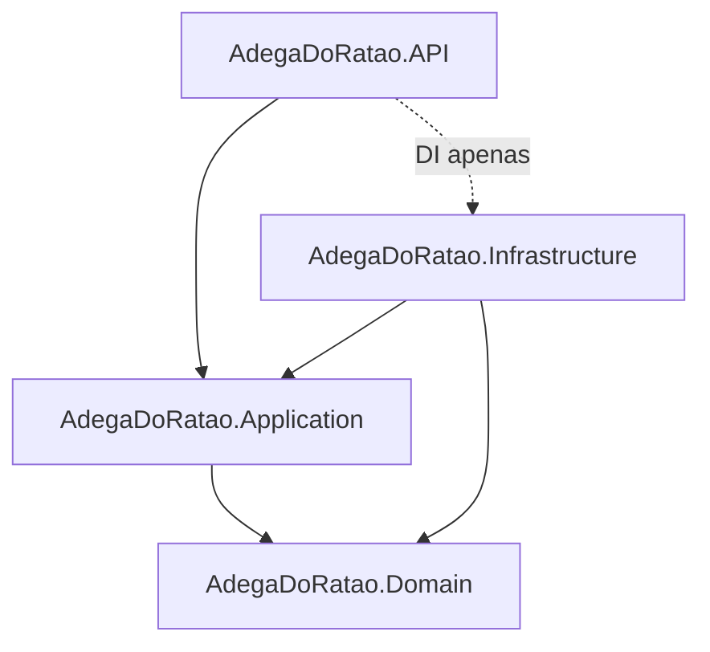
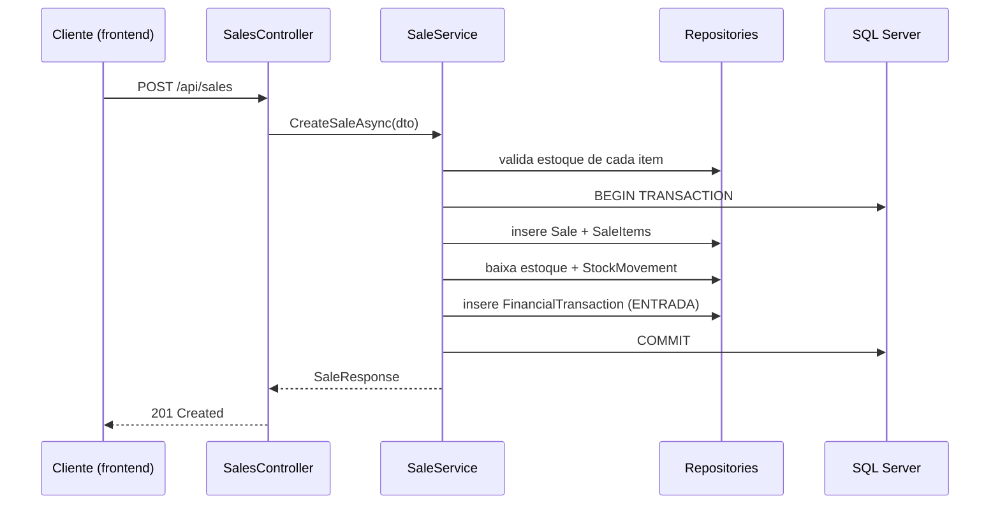

# 01 — Arquitetura — Adega do Ratão

## 1. Visão Geral do Sistema

O **Adega do Ratão** é um sistema de gestão (backend) para uma adega/loja de bebidas, cobrindo produtos, estoque, compras, vendas, financeiro, dashboard, usuários e auditoria. É construído como uma API REST em .NET, pronta para ser consumida futuramente por um frontend React/TypeScript.

## 2. Objetivo do Sistema

Fornecer uma base sólida, testável e extensível para que o lojista consiga: cadastrar produtos e categorias, controlar entradas/saídas de estoque com rastreabilidade total, registrar compras de fornecedores, registrar vendas com baixa automática de estoque, acompanhar o fluxo de caixa e visualizar indicadores em um dashboard — tudo com controle de acesso por perfil e trilha de auditoria.

## 3. Justificativa e Ajustes de Stack

A stack solicitada é adotada quase integralmente, com um ajuste:

- **.NET**: será usado o **.NET 8 LTS** em vez de ".NET 10 ou LTS mais adequado", pois no momento da implementação o .NET 8 é a versão LTS estável amplamente suportada no ecossistema (EF Core, bibliotecas, tooling). Se, no momento da implementação real, uma versão LTS mais nova já estiver disponível e estável no ambiente, ela será usada — o ponto fixo é "LTS estável", não o número da versão.
- Demais itens da stack (ASP.NET Core Web API, EF Core, SQL Server, Swagger/OpenAPI, JWT, FluentValidation, Serilog, xUnit, Moq) são mantidos como propostos.

## 4. Estilo Arquitetural

**Clean Architecture** em 4 camadas, com DDD "tático" leve (entidades ricas, value objects pontuais, sem event sourcing/CQRS completo — não se justifica pelo escopo). Repository Pattern é usado como abstração de persistência por entidade agregada; Unit of Work é usado para garantir atomicidade em operações que tocam múltiplas tabelas (venda, compra).

Princípio geral: **Domain não depende de nada**; **Application depende só de Domain**; **Infrastructure implementa interfaces definidas em Application/Domain**; **API depende de Application (e Infrastructure só via DI na composition root)**.



## 5. Estrutura de Projetos

```text
AdegaDoRatao/
├── src/
│   ├── AdegaDoRatao.Domain/
│   │   ├── Entities/
│   │   ├── Enums/
│   │   ├── ValueObjects/
│   │   ├── Exceptions/
│   │   └── Interfaces/            # contratos de repositório (IProductRepository, etc.)
│   │
│   ├── AdegaDoRatao.Application/
│   │   ├── DTOs/
│   │   ├── Interfaces/            # IProductService, IUnitOfWork, IAuditService...
│   │   ├── Services/              # implementação dos casos de uso
│   │   ├── Validators/            # FluentValidation
│   │   ├── Mappings/              # AutoMapper profiles (opcional) ou mapeadores manuais
│   │   ├── Common/                # Result<T>, PagedResult<T>, exceptions de aplicação
│   │   └── DependencyInjection.cs
│   │
│   ├── AdegaDoRatao.Infrastructure/
│   │   ├── Persistence/
│   │   │   ├── AppDbContext.cs
│   │   │   ├── Configurations/    # IEntityTypeConfiguration<T> por entidade
│   │   │   └── Migrations/
│   │   ├── Repositories/
│   │   ├── Auth/                  # geração/validação de JWT, hashing
│   │   ├── Logging/                # setup Serilog
│   │   └── DependencyInjection.cs
│   │
│   └── AdegaDoRatao.API/
│       ├── Controllers/
│       ├── Middlewares/           # ExceptionHandlingMiddleware, etc.
│       ├── Filters/
│       ├── Extensions/            # Swagger, JWT, CORS setup
│       ├── Program.cs
│       └── appsettings.json
│
├── tests/
│   ├── AdegaDoRatao.UnitTests/
│   │   ├── Application/
│   │   └── Domain/
│   └── AdegaDoRatao.IntegrationTests/
│       └── Controllers/
│
├── docs/
├── .gitignore
├── README.md
└── AdegaDoRatao.sln
```

Estrutura mantida essencialmente igual à proposta original — é adequada ao escopo, sem necessidade de camadas extras (ex.: não se justifica um projeto `Shared`/`CrossCutting` separado; itens transversais ficam em `Application/Common` e `Infrastructure/Logging`).

## 6. Componentes por Camada

- **Entidades (Domain)**: `User`, `Role`, `Product`, `Category`, `Brand`, `StockMovement`, `Supplier`, `Purchase`, `PurchaseItem`, `Sale`, `SaleItem`, `PaymentMethod` (enum), `FinancialCategory`, `FinancialTransaction`, `AuditLog`. (Detalhamento em `04-BANCO-DE-DADOS.md`.)
- **DTOs (Application)**: um conjunto Request/Response por entidade exposta na API (ex.: `CreateProductRequest`, `ProductResponse`, `UpdateStockRequest`), evitando expor entidades de domínio diretamente.
- **Interfaces**: `IProductRepository`, `IStockRepository`, `ISaleRepository`, `IUnitOfWork`, `IProductService`, `ISaleService`, `IAuditService`, `ICurrentUserService`, `IPasswordHasher`, `IJwtTokenGenerator`.
- **Services (Application)**: implementam os casos de uso/regras de negócio (ex.: `SaleService` orquestra validação de estoque, baixa, movimentação e lançamento financeiro dentro de uma transação via `IUnitOfWork`).
- **Repositories (Infrastructure)**: implementação EF Core dos contratos de Domain/Application, um repositório por agregado.
- **Controllers (API)**: finos — recebem DTO, chamam o Service correspondente, retornam `ActionResult` com o `Response` DTO. Sem lógica de negócio.
- **Middlewares**: `ExceptionHandlingMiddleware` (converte exceções em `ProblemDetails`), middleware de log de requisições (Serilog).

## 7. Injeção de Dependência

Cada camada expõe um `AddXxx(this IServiceCollection)` (`AddApplication`, `AddInfrastructure`) chamado a partir de `Program.cs`, mantendo a composição centralizada e evitando referências cruzadas.

## 8. Fluxos Principais (visão geral)



Detalhes de cada fluxo (compra, venda, cancelamento, movimentação de estoque) estão em `03-REGRAS-DE-NEGOCIO.md`.

## 9. Evoluções Futuras de Arquitetura

Ver `08-ROADMAP.md`.
