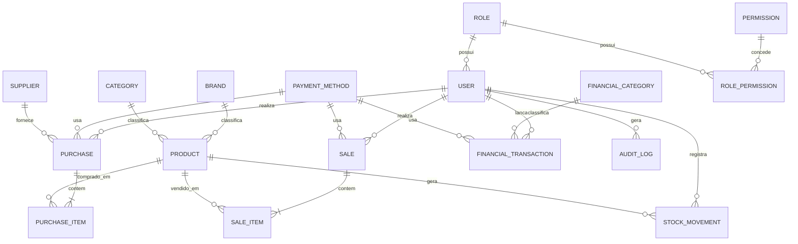

# 04 — Banco de Dados — Adega do Ratão

Banco: **SQL Server**, acesso via **Entity Framework Core** (Code First + Migrations).

## 1. Entidades Adotadas

Da lista sugerida, todas se justificam, com dois ajustes:

- `Permission` é modelada como tabela (`Permission`) associada a `Role` via tabela de junção `RolePermission`, permitindo evoluir permissões sem migration a cada novo perfil.
- `PaymentMethod` é uma tabela de referência simples (id + nome + ativo), não um agregado complexo — evita "over-engineering" mantendo a flexibilidade pedida (não fixar em enum de código).

Entidades finais: `User`, `Role`, `Permission`, `RolePermission`, `Product`, `Category`, `Brand`, `StockMovement`, `Supplier`, `Purchase`, `PurchaseItem`, `Sale`, `SaleItem`, `PaymentMethod`, `FinancialCategory`, `FinancialTransaction`, `AuditLog`.

Observação: não existe tabela `Stock` separada — o estoque atual é um **campo no próprio `Product`** (`CurrentStock`), calculado/atualizado a cada `StockMovement` dentro da mesma transação (RN09). Criar uma tabela `Stock` 1:1 com `Product` adicionaria um join sem benefício real neste escopo.

## 2. Campos Principais por Entidade

### Product
`Id (PK, uniqueidentifier)`, `Name`, `Description`, `Sku (unique)`, `Barcode (unique, nullable)`, `CategoryId (FK)`, `BrandId (FK)`, `UnitOfMeasure`, `CostPrice (decimal 18,2)`, `SalePrice (decimal 18,2)`, `CurrentStock (int)`, `MinStock (int)`, `MaxStock (int, nullable)`, `AllowNegativeStock (bool)`, `IsActive (bool)`, `CreatedAt`, `UpdatedAt`, `RowVersion (concurrency token)`.

### Category / Brand
`Id`, `Name (unique)`, `IsActive`, `CreatedAt`, `UpdatedAt`.

### StockMovement
`Id`, `ProductId (FK)`, `Type (enum: ENTRADA/SAIDA/AJUSTE)`, `Quantity`, `PreviousStock`, `NewStock`, `Reason`, `UserId (FK)`, `ReferenceType (nullable — "Purchase"/"Sale"/null)`, `ReferenceId (nullable)`, `CreatedAt`.

### Supplier
`Id`, `Name`, `Document (CNPJ/CPF)`, `Phone`, `Email`, `IsActive`, `CreatedAt`, `UpdatedAt`.

### Purchase / PurchaseItem
`Purchase`: `Id`, `SupplierId (FK)`, `Date`, `Discount`, `Freight`, `Total`, `PaymentMethodId (FK)`, `Status (PENDENTE/RECEBIDA/CANCELADA)`, `CreatedByUserId`, `CreatedAt`.
`PurchaseItem`: `Id`, `PurchaseId (FK)`, `ProductId (FK)`, `Quantity`, `UnitCost`, `Subtotal`.

### Sale / SaleItem
`Sale`: `Id`, `SaleNumber (unique, sequencial)`, `Date`, `UserId (FK)`, `Discount`, `Total`, `PaymentMethodId (FK)`, `Status (CONCLUIDA/CANCELADA)`, `CreatedAt`.
`SaleItem`: `Id`, `SaleId (FK)`, `ProductId (FK)`, `Quantity`, `UnitPrice`, `Subtotal`.

### PaymentMethod
`Id`, `Name`, `IsActive`.

### FinancialCategory
`Id`, `Name`, `Type (ENTRADA/SAIDA)`, `IsActive`.

### FinancialTransaction
`Id`, `Description`, `Type (ENTRADA/SAIDA)`, `FinancialCategoryId (FK)`, `Amount (decimal 18,2)`, `Date`, `PaymentMethodId (FK, nullable)`, `Status (PENDENTE/PAGO/ESTORNADO)`, `UserId (FK)`, `ReferenceType (nullable — "Sale"/"Purchase"/null)`, `ReferenceId (nullable)`, `Notes`.

### User / Role / Permission / RolePermission
`User`: `Id`, `Name`, `Email (unique)`, `PasswordHash`, `RoleId (FK)`, `IsActive`, `CreatedAt`.
`Role`: `Id`, `Name (unique)`.
`Permission`: `Id`, `Code (unique, ex.: "products.write")`, `Description`.
`RolePermission`: `RoleId (FK)`, `PermissionId (FK)` — chave composta.

### AuditLog
`Id`, `UserId (FK, nullable — ações de sistema)`, `Action`, `EntityName`, `EntityId`, `OldValues (json, nullable)`, `NewValues (json, nullable)`, `Timestamp`.

## 3. Relacionamentos e Cardinalidade

- `Category (1) — (N) Product`
- `Brand (1) — (N) Product`
- `Product (1) — (N) StockMovement`
- `Supplier (1) — (N) Purchase`
- `Purchase (1) — (N) PurchaseItem — (N) Product`
- `Sale (1) — (N) SaleItem — (N) Product`
- `PaymentMethod (1) — (N) Sale`, `PaymentMethod (1) — (N) Purchase`, `PaymentMethod (1) — (N) FinancialTransaction`
- `FinancialCategory (1) — (N) FinancialTransaction`
- `Role (1) — (N) User`
- `Role (N) — (N) Permission` via `RolePermission`
- `User (1) — (N) StockMovement`, `User (1) — (N) Sale`, `User (1) — (N) Purchase`, `User (1) — (N) AuditLog`

## 4. Diagrama ER

## 5. Índices e Constraints Principais

- `UNIQUE` em `Product.Sku`, `Product.Barcode (filtered, WHERE NOT NULL)`, `Category.Name`, `Brand.Name`, `User.Email`, `Sale.SaleNumber`.
- Índice não-clusterizado em `StockMovement.ProductId + CreatedAt`, `Sale.Date`, `FinancialTransaction.Date`, `FinancialTransaction.Type`.
- `FK` com `ON DELETE RESTRICT` (sem cascade) para preservar histórico — soft delete é o mecanismo de "remoção".
- `CHECK` constraint (`CostPrice >= 0`, `SalePrice >= 0`, `Quantity > 0` em itens) reforçando as validações de aplicação.
- `RowVersion` (`rowversion`/`timestamp`) em `Product` para concorrência otimista em atualizações de estoque.

## 6. Estratégia de Migrations

- EF Core Migrations, uma migration por incremento funcional coerente (ex.: `InitialCreate`, `AddStockModule`, `AddFinancialModule`), nunca uma migration monolítica.
- Migrations aplicadas via `dotnet ef database update` em desenvolvimento; em produção, aplicadas em pipeline de deploy controlado (nunca `EnsureCreated`).
- Dados de referência (roles, permissions, payment methods, financial categories padrão) inseridos via `HasData` ou um `DbSeeder` idempotente executado na inicialização/pipeline.
