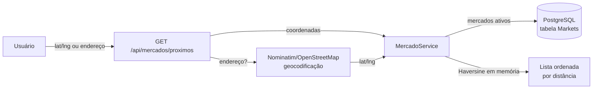

# 18 — Filtro de Mercados Próximos

## Objetivo

Dado um ponto de referência do usuário (coordenadas do GPS ou um endereço/CEP
digitado), retornar os mercados do catálogo (Veran, Shibata, Atacadão, Semar
etc.) **ordenados por distância**, dentro de um raio configurável.

## Como funciona



1. **Entrada por coordenadas**: o frontend envia `latitude` e `longitude`
   (ex.: GPS do celular).
2. **Entrada por endereço/CEP**: o backend geocodifica o texto via
   **Nominatim (OpenStreetMap)** — gratuito, sem chave de API — e reutiliza
   exatamente a mesma lógica de busca.
3. **Cálculo de distância**: fórmula de **Haversine em C# puro**
   (`GeoDistance.CalcularKm`), aplicada em memória sobre os mercados ativos
   carregados do banco. Erro típico < 0,5%, suficiente para raios de até 20 km.
4. **Resposta**: lista ordenada do mais próximo ao mais distante, com
   `distanciaKm` já calculada (2 casas decimais).

## Endpoint

```
GET /api/mercados/proximos?latitude=-23.5425&longitude=-46.3108&raioKm=5
GET /api/mercados/proximos?endereco=Rua+Exemplo,+Suzano&raioKm=5
```

| Parâmetro   | Tipo   | Obrigatório | Padrão | Limites            |
|-------------|--------|-------------|--------|--------------------|
| latitude    | double | sim*        | —      | -90 a 90           |
| longitude   | double | sim*        | —      | -180 a 180         |
| endereco    | string | sim*        | —      | texto livre ou CEP |
| raioKm      | double | não         | 5      | 0,5 a 20           |

\* Informe **latitude + longitude** OU **endereco**. Se nenhum dos dois for
enviado, a API retorna 400 com mensagem orientando o uso.

Erros de geocodificação (endereço não encontrado, serviço indisponível,
timeout) retornam **HTTP 400** com mensagem clara para o frontend — nunca 500.

## Faixas de distância sugeridas para a UI

| Distância     | Sugestão de rótulo | Ícone sugerido |
|---------------|--------------------|----------------|
| até 1,5 km    | "Perto — dá pra ir a pé" | 🚶 |
| 1,5 a 5 km    | "Perto — melhor de carro" | 🚗 |
| 5 a 10 km     | "Um pouco mais longe" | 🛣️ |
| acima de 10 km| "Longe — considere entrega" | 📦 |

Essas faixas são apenas sugestão de apresentação; o backend devolve apenas
`distanciaKm` e a UI decide como rotular.

## Configuração

### Geocodificação (seção `Geocoding`)

O padrão é o Nominatim público — **nenhuma chave é necessária**. Opcionalmente
é possível ajustar:

```json
"Geocoding": {
  "BaseUrl": "https://nominatim.openstreetmap.org",
  "UserAgent": "AdegaDoRatao/1.0 (contato@adegadoratao.local)",
  "TimeoutSeconds": 10
}
```

> O Nominatim **exige** um `User-Agent` identificando a aplicação (política
> de uso do OSM) e limita requisições a ~1/segundo. Para produção com volume
> alto, considere uma instância própria do Nominatim ou um provedor pago.

### Migração futura para Google Maps Geocoding (opcional)

Se migrar para o Google, a chave **nunca** vai no `appsettings.json`:

```powershell
# Desenvolvimento
dotnet user-secrets set "Geocoding:ApiKey" "SUA_CHAVE" --project src/AdegaDoRatao.API

# Produção (variável de ambiente)
Geocoding__ApiKey=SUA_CHAVE
```

Mesmo padrão já usado para `Jwt:Secret` e `DataMarket:ApiKey`.

## Banco de dados

A tabela `Markets` (migration `AddMarkets`) guarda nome, rede, endereço e as
coordenadas (`Latitude`/`Longitude`, `double`) de cada loja, com índice
composto em `(Latitude, Longitude)`.

### Sobre PostGIS

A implementação atual **não depende de PostGIS**: o cálculo é feito em memória
(Haversine em C#), o que funciona em qualquer PostgreSQL — e até em SQLite nos
testes. É a escolha certa enquanto o catálogo tem dezenas/centenas de lojas.

Se o catálogo crescer para **milhares** de lojas, o filtro pode ser movido
para o banco:

```sql
-- Com a extensão PostGIS habilitada:
CREATE EXTENSION postgis;

-- Filtro + ordenação direto no banco (geography, índice GiST):
SELECT *, ST_DistanceSphere(geom, ST_MakePoint(:lng, :lat)) / 1000.0 AS distancia_km
FROM "Markets"
WHERE ST_DistanceSphere(geom, ST_MakePoint(:lng, :lat)) <= :raioMetros
ORDER BY geom <-> ST_MakePoint(:lng, :lat);
```

Essa migração é transparente para a Application/API: basta trocar a
implementação de `IMarketRepository.ListarAtivosAsync` por uma consulta com
filtro geográfico.

## Testes

- `GeoDistanceTests`: Haversine validado contra distâncias reais conhecidas
  (Suzano → São Paulo ≈ 33 km; 1° de latitude ≈ 111,19 km; simetria).
- `MercadoServiceTests`: raio sem resultados, ordenação por distância, filtro
  pelo raio, validação dos limites (0,5–20 km) e geocodificação **mockada**
  (os testes nunca batem na API externa real).
