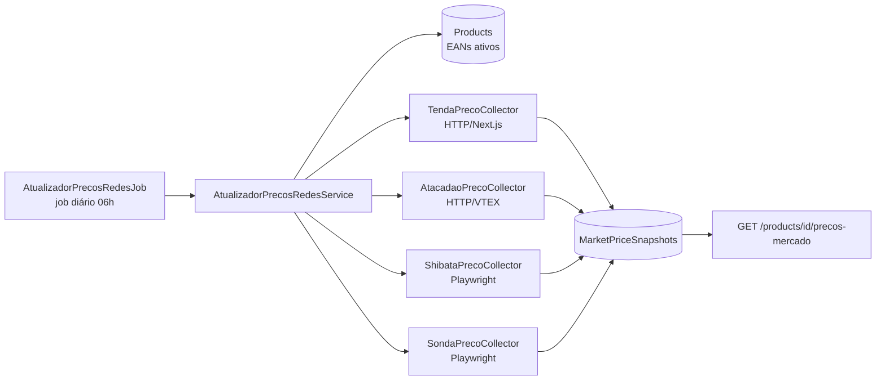

# 19 — Agente de Preços (coletores por rede)

## Objetivo

Coletar automaticamente os preços dos produtos cadastrados (por EAN) nos
sites das redes de mercado da região, considerando o CEP da adega
(08503-000, Ferraz de Vasconcelos), e gravar snapshots no banco para
consulta instantânea pelo endpoint `GET /api/products/{id}/precos-mercado`.

## Arquitetura



## Coletores

| Rede | Técnica | Fonte | Velocidade |
|------|---------|-------|-----------|
| **Tenda** | HTTP direto | `__NEXT_DATA__` da página `/busca?q={ean}` | ~1s |
| **Atacadão** | HTTP direto | API VTEX `/io/api/catalog_system/pub/products/search` | ~1s |
| **Shibata** | Playwright (Chromium) | SPA Angular — API exige token de sessão | 3-10s |
| **Sonda** | Playwright (Chromium) | WebForms — busca exige ViewState | 3-10s |

Cada coletor implementa `IPrecoRedeCollector` e devolve
`Result<ColetaPrecoRede>` — falhas (timeout, bloqueio, mudança de layout)
nunca interrompem as demais redes nem o job.

## Fluxo de consulta (endpoint de preços)

1. O endpoint `GET /api/products/{id}/precos-mercado` **primeiro** lê os
   snapshots locais (`MarketPriceSnapshots`) do EAN — resposta instantânea,
   sem depender de API externa.
2. Se não houver snapshot para o EAN, cai no fluxo antigo (API Data Market).

## Job diário

`AtualizadorPrecosRedesJob` (BackgroundService) roda todo dia às **06h**,
varrendo todos os produtos ativos com EAN e atualizando os snapshots
(um registro por EAN + rede, com `ColetadoEm`).

## Configuração

### Playwright (necessário para Shibata e Sonda)

Após o build, instale o navegador uma única vez:

```powershell
# Na pasta do projeto Infrastructure (ou da API, após publicar)
pwsh src/AdegaDoRatao.Infrastructure/bin/Debug/net8.0/playwright.ps1 install chromium
```

Sem esse passo, os coletores Playwright falham (logado como warning) e o
job segue apenas com Tenda e Atacadão.

### Banco de dados

```powershell
dotnet ef database update --project src/AdegaDoRatao.Infrastructure --startup-project src/AdegaDoRatao.API
```

A migration `AddMarketPriceSnapshots` cria a tabela com índice único
`(Ean, Rede)`.

## Limitações conhecidas

- **Termos de uso**: a coleta automatizada pode violar os ToS dos sites.
  Use com moderação (o job diário faz no máximo 4 requisições por produto
  por dia) e sob sua responsabilidade.
- **Fragilidade**: mudanças de layout/estrutura dos sites quebram os
  coletores — os seletores CSS do Shibata/Sonda e o parser do `__NEXT_DATA__`
  do Tenda são os pontos mais sensíveis. Falhas são logadas e não derrubam
  o job.
- **Preço por CEP**: o Tenda e o Atacadão retornam o preço da loja padrão
  da região; a simulação exata por CEP (08503-000) está disponível na VTEX
  (`orderForms/simulation`) mas ainda não é usada — o preço de catálogo já
  é suficiente para a comparação.
